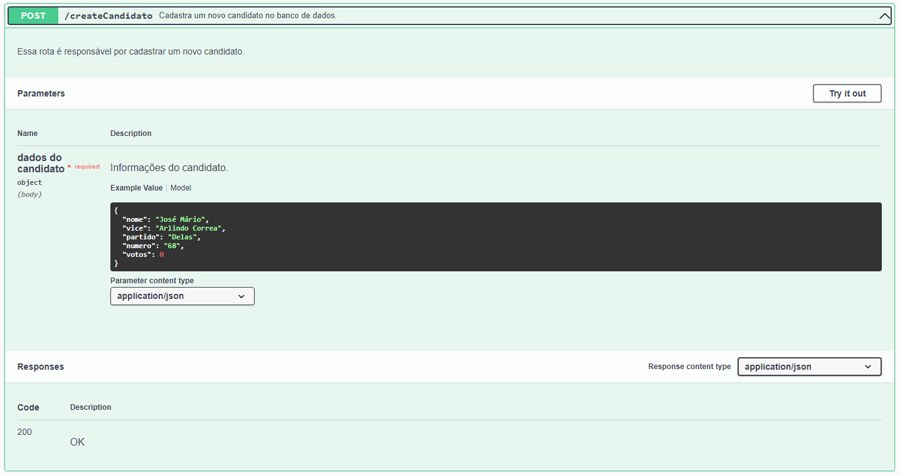
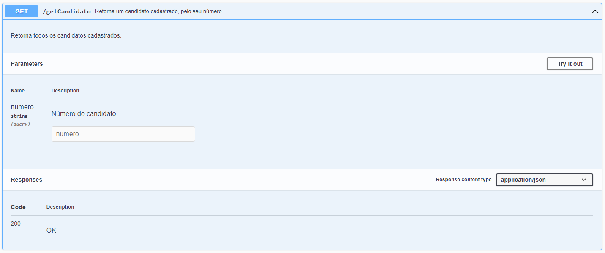
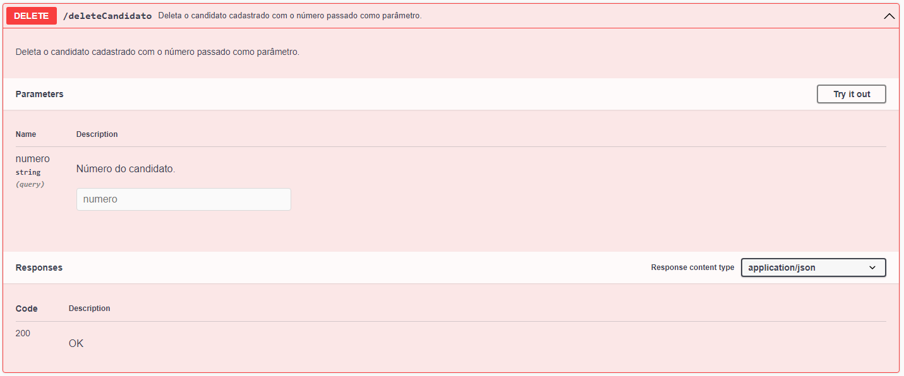
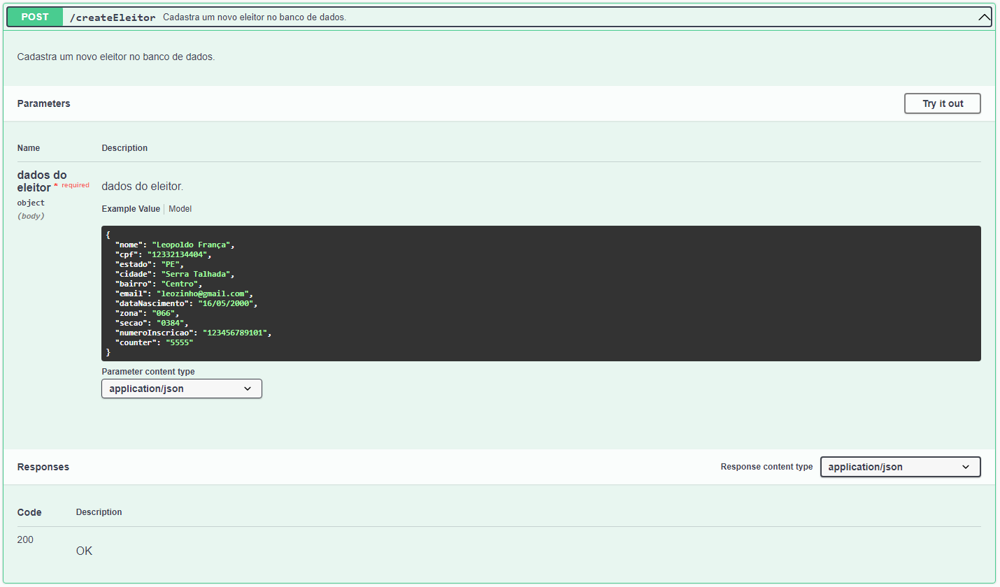
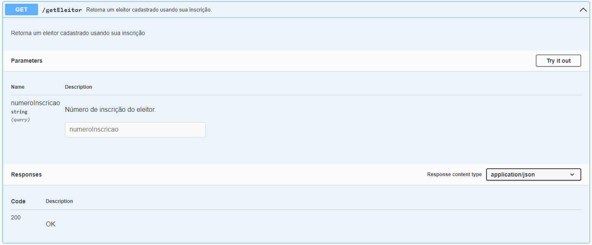

# API Urna Eletrônica 🗳️

### Proposta 📝: 

- API com as funcionalidades do sistema de cadastro de um sistema de votação. 
- Interação com o banco de dados para cadastrar as informações dos candidatos e dos eleitores.
- Resgate e busca de informações do banco de dados.
- Entrega e tratamento dos dados guardados no banco. 

### Tecnologias 🌎: 

- Documentada com Swagger UI.
- Utilizando Javascript no NodeJS.
- Banco de dados MongoDB.
- API REST com Express.
- Testes unitários com Jest.

## Sumário 📒: 

- [Documentação](#documentação-)

- [Candidatos](#candidatos-)

     - [POST](#post---candidatos)
     - [GET](#get---candidatos)
     - [DELETE](#delete---candidatos)
     - [PUT](#put---candidatos)

- [Eleitores](#eleitores-)

     - [POST](#post---eleitores)
     - [GET](#get---eleitores)
     - [DELETE](#delete---eleitores)
     - [PUT](#put---eleitores)


## Documentação 📃:


### Instalem as dependências antes de iniciar a API. 
```javascript  
npm install 
``` 
ou 
```javascript  
npm i 
``` 
#### Obs.: O link de conexão com o banco de dados está registrado em um `.env`, então é necessária a criação do arquivo e adicionar a variável *URL + o link de conexão com o banco de dados.*
```javascript  
//exemplo de link de conexão:

URL="mongodb://localhost:0000/suaCollection"

//por padrão a URL de testes é: 

URL="mongodb://localhost:27017/urna"
``` 
### Após instalar as dependências, a documentação ficará visível na rota http://localhost:8080/urna/doc/ ao executar a API com o comando:
```javascript  
npm start 
``` 
## Rotas 🌐:

## Candidatos 🧑‍💼
### **[⬆ VOLTAR AO SUMÁRIO](#sumário-)**
### POST - Candidatos🟩
#### **Cadastrar Candidato** : http://localhost:8080/urna/createCandidato 

- Recebe um `json` para inserção dos dados. Dentro da aplicação recebe um objeto javascript que é convertido automaticamente para `json`
- Cadastra os candidatos com as informações fornecidas. Por padrão o `schema` passado é: 
```javascript  
{
    nome: { type: String, required: true },
    vice: { type: String, required: true },
    partido: { type: String, required: true },
    numero: { type: String, required: true },
    votos: { type: Number, required: true },
}
``` 

### GET - Candidatos🟦
#### **Retorna todos os candidatos cadastrados**: http://localhost:8080/urna/getAllCandidatos

- Retorna todos os candidatos que estiverem cadastrados no banco de dados. Retorna um `json` que é convertido para um objeto Javascript como no exemplo abaixo: 
```javascript  
{
  "nome": "José Mário",
  "vice": "Arlindo Correa",
  "partido": "Delas",
  "numero": "68",
  "votos": 0
}
``` 
#### **Retorna um candidato cadastrado, localizando ele pelo seu número:** http://localhost:8080/urna/getCandidato
-  O retorno é similar ao da rota anterior, porém retorna apenas o objeto que tiver o mesmo número solicitado.


### DELETE - Candidatos🟥
#### **Deletar Candidato** : http://localhost:8080/urna/deleteCandidato

- Remove um acolhido do banco de dados, localizando ele com sua matrícula. Essa rota retorna um `json` com duas informações. Se o objeto foi reconhecido na busca, que retorna `true` para localizado e `false` para não localizado, e retorna também um contador informando se ele foi deletado ou não, sendo `0` para não deletado e `1` para deletado. 
```javascript
{
  "acknowledged": true,
  "deletedCount": 1
}
```

### PUT - Candidatos🟨
#### **Atualizar informações do candidato** : http://localhost:8080/urna/updateCandidatos/:numero

- Atualiza as informações do candidato. Localizando ele através de seu número e passando os dados a serem atualizados. Similar ao cadastro, porém precisando localizar o acolhido. 

## Eleitores 👨‍🦱
### **[⬆ VOLTAR AO SUMÁRIO](#sumário-)**
### POST - Eleitores🟩
#### **Cadastrar eleitor** : http://localhost:8080/urna/createEleitor



- Recebe um `json` para inserção dos dados. Dentro da aplicação recebe um objeto javascript que é convertido automaticamente para `json`
- Cadastra o eleitor com as informações fornecidas. Por padrão o `schema` passado é: 
```javascript
{
    nome: { type: String, required: true },
    cpf: { type: String, required: true },
    estado: { type: String, required: true },
    cidade: { type: String, required: true },
    bairro: { type: String, required: true },
    email: { type: String, required: true },
    dataNascimento: { type: String, required: true },
    zona: { type: String, required: true },
    secao: { type: String, required: true },
    numeroInscricao: { type: String, required: true },
    counter: { type: String, required: true },
    nice: { type: String, required: true },
}
```
#### **Validar credencial** : http://localhost:8080/urna/authentication


- Recebe o login e a senha passada pelo usuário e faz a validação se está correto retornando ```{ valido: true }``` caso a credencial esteja correta ou ```{ valido: false }``` para incorreta.

### GET - Eleitores🟦
#### **Retorna todos os eleitores cadastrados**: http://localhost:8080/urna/getAllEleitores

- Retorna todos os eleitores que estiverem cadastrados no banco de dados. Retorna um `json` que é convertido para um objeto Javascript como no exemplo abaixo: 
```javascript 
{
    "_id": "628d22596f080298029657b8",
    "nome": "Leopoldo França",
    "cpf": "12332134404",
    "estado": "PE",
    "cidade": "Serra Talhada",
    "bairro": "Centro",
    "email": "leozinho@gmail.com",
    "dataNascimento": "16/05/2000",
    "zona": "066",
    "secao": "0384",
    "numeroInscricao": "123456789101",
    "counter": "c6157e1efecf1f5718c24397d5961098",
    "nice": "7f05abfb90f0c7e6abb015995761c058",
    "__v": 0
}
```
#### **Retorna um eleitor cadastrado, localizando-a por seu número de inscrição:** http://localhost:8080/urna/getEleitor
-  O retorno é similar ao da rota anterior, porém retorna apenas o objeto que tiver o mesmo número de inscrição solicitado.


### DELETE - Eleitores🟥
#### **Deletar Eleitor** : http://localhost:8080/urna/deleteEleitor

- Remove um eleitor do banco de dados, localizando-a com seu número de inscrição. Essa rota retorna um `json` com duas informações. Se o objeto foi reconhecido na busca, que retorna `true` para localizado e `false` para não localizado, e retorna também um contador informando se ele foi deletado ou não, sendo `0` para não deletado e `1` para deletado. 
```javascript
{
  "acknowledged": true,
  "deletedCount": 1
}
```
### PUT - Eleitores🟨
#### **Atualizar informações do acolhido** : http://localhost:8080/urna/updateEleitor/:numeroInscricao

- Atualiza as informações de um eleitor. Localizando-a através de seu número de inscrição e passando os dados a serem atualizados. Similar ao cadastro, porém precisando localizar o eleitor. 


### 🤫 & 💼 ⬛

#### **Silêncio e Trabalho** : http://localhost:8080/urna/silenceAndWork

- Silêncio e Trabalho. 🤫 & 💼

### **[⬆ VOLTAR AO SUMÁRIO](#sumário-)**
### Suporte 🆘

#### Em casos de dúvidas ou sugestôes entrar em contato com o time exódia através do nosso [email](mailto:storeexodia@gmail.com)!

